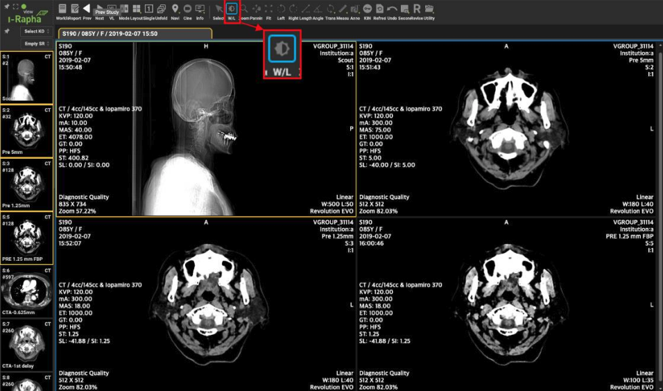

# Image Orientation and Manipulation

Interpretation of the orientation
The orientation of the DICOM images is displayed by one or more uppercase letters in the middle on the top and left of the view.

If Anatomical Orientation Type (0010,2210) attribute is absent or has a value of BIPED, anatomical direction is:

A: anterior
P: posterior
R: right
L: left
H: head
F: foot
If Anatomical Orientation Type (0010,2210) attribute has a value of QUADRUPED (since Version4.1.0), anatomical direction is designated by:

LE: Left
RT: Right
D: Dorsal
V: Ventral
CR: Cranial
CD: Caudal
R: Rostral
M: Medial
L: Lateral
PR: Proximal
DI: Distal
PA: Palmar
PL: Plantar

## Zooming, Panning, Rotating

영상 확대/축소

[영상표시창]에 표시된 영상을 확대 또는 축소하여 표시하는 기능입니다
영상을 선택한 후 마우스 오른쪽 버튼을 클릭하면 컨텍스트 메뉴가 표시됩니다. 축소( - ) 아이콘 또는 확대( + ) 아이콘을 클릭하여 정해진 비율 단계로 영상 크기를 조정할 수 있습니다. 설정 가능한 범위는 25% ~ 500% 이며 25~200 구간은 25% 단계, 200 ~ 500 구간은 50% 단계로 확대/축소됩니다.
세밀한 크기 조정 이 필요한 경우 텍스트 입력란을 통해 원하는 비율을 입력하고 키보드에서 Enter 키를 눌러주면 입력된 비율로 영상 크기가 조정됩니다. 입력 가능한 범위는 25 ~ 500 사이의 값으로 지정된 단계 없이 자유롭게 입력 가능합니다.

## Pan
영상 표시창에 표시된 영상의 위치를 이동하여 표시하는데 사용하는 기능입니다. 자세한 내용은
본 장의 『Pan(영상 위치이동) 메뉴』의 내용을 참조하시기 바랍니다.

## Fit
영상이 Zoom 기능으로 확대·축소되거나 Pan 기능으로 이동표시되어 있을 때 영상표시칸에 영상이
처음 표시된 상태로 조정하여 되돌리는 기능입니다. 자세한 내용은 본 장의 『Fit(영상 크기 및 위치
맞춤) 메뉴』의 내용을 참조하시기 바랍니다.

## Length
영상의 원하는 부위에 마우스로 시작점과 끝점을 선택하면 이 시작점과 끝점을 잇는 측정선이 표시되고, 그 직선의 길이를 측정하는 기능입니다. 자세한 내용은 본 장의 『Length(길이 측정) 메뉴』의 내용을 참조하시기 바랍니다.

## Angle
각도를 측정하기 원하는 부위에 2 개의 선을 표시하고 그 선들이 이루고 있는 각도를 측정하는 기능입니다. 자세한 내용은 본 장의 『Angle(각도측정) 메뉴』의 내용을 참조하시기 바랍니다.

## Transformations
영상에 변형을 가하여 영상조회에 도움을 주는 기능들이 모여 있습니다. Transformations 항목을 선택하면 하위메뉴가 나타납니다. 자세한 내용은 본 장의 『Transformations(영상변형도구) 메뉴』의 내용을 참조하시기 바랍니다.

Note
The zoom function always zooms in/out to the center of the screen regardless of where the cursor is. This mode provides greater positional accuracy in particular situations.

Since “Resize to best fit” is the default mode for a view, the image will be centered when scrolling to the next image. You need to change the mode or the zoom factor to keep the image off center when scrolling.

## Adjusting Window/Level (Brightness & Contrast)

W/L(영상 밝기/대조도 조정)
메뉴바의 [W/L] 메뉴는 [영상표시창]의 영상의 Window Width 값과 Level 값을 조정하여 보기 위한 메뉴입니다.
[W/L] 메뉴가 선택된 상태에서 마우스를 상하좌우로 드래그하여 W/L 을 조절할 수 있습니다.
Window Width 는 대조도(Contrast)를, Window Level 은 밝기(Bright)를 의미합니다

## Histogram

## Left / Right (영상 회전)
메뉴바의 [Left]기능은 Transformations 메뉴에서 설명할 [Rotate Left]와 같은 기능을 수행합니다.
메뉴바의 [Right]기능은 Transformations 메뉴에서 설명할 [Rotate Right]와 같은 기능을 수행합니다.

