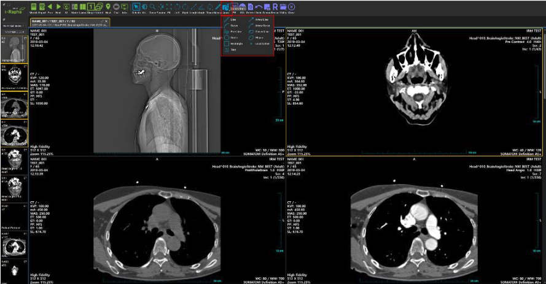

# Annotation and Measurement

## Annotation 
메뉴바의 [Annot.] 메뉴에는 영상의 주석을 입력하는 기능들이 모여 있습니다. [Annot.] 메뉴를 선택하면 하위메뉴가 나타납니다. 하위메뉴의 구성은 다음과 같습니다.

- Line: 영상 위에 직선 주석을 삽입합니다. 
- Arrow Line: 영상 위에 화살표 주석을 삽입합니다. 
- Curve: 영상 위에 곡선 주석을 삽입합니다. 
- Arrow Curve: 영상 위에 휘어진 화살표 주석을 삽입합니다. 
- Free Line: 영상 위에 자S유선 주석을 삽입합니다. 
- Closed Line: 영상 위에 폐곡선 주석을 삽입합니다. 
- Circle: 영상 위에 원 주석을 삽입합니다. 
- Ellipse: 영상 위에 타원 주석을 그립니다. 
- Rectangle: 영상 위에 사각형 주석을 삽입합니다. 
- Magnifie: 영상의 일부분을 확대하여 표시합니다
- Localization: 영상 위에 위치표시점을 삽입합니다. 
- Text: 영상 위에 글자 주석을 삽입합니다.
- 3 Points Angle: 지정한 3 개의 점이 이루는 각도를 표시합니다.
- Cobb’s Angle: Cobb 앵글을 측정합니다. 척추의 만곡도(굽은정도)를 측정할 때 사용합니다.
- Pixel Value: 지정된 Piexel의 2 차원 또는 3 차원 좌표상의 위치값과 컬러값(CT의 경우 하운스필드값)을 표시합니다.
- Pixel HU Value: 마우스로 클릭한 위치의 픽셀 값을 저장합니다.
- CT Ratio: CT Ratio(Cardiothoracic Ratio, 심흉비)를 측정합니다.
- Calibrate: 픽셀의 길이정보(mm)가 없거나 부정확한 경우, 단위길이를 다시 지정하여 전체 측정값을 재계산합니다.

Undo(실행취소)
메뉴바의 [Undo] 메뉴는 영상에 마지막으로 삽입된 주석(Annotation)이나 측정(Measurement)을
취소하는 메뉴입니다.

### Center Line 기능 사용법

1. 골격등 특정 부위의 폭을 측정할 수 있는 직선을 그립니다.
2. 다른 부위의 폭을 측정할 수 있는 직선을 그립니다.
3. 두 직선의 길이와 함께 두 직선의 중심점간의 거리와 각도를 측정합니다.

### Cobb’s Angle 기능 사용법

1. 1 번, 2 번 두 점을 클릭하여 상단에 가장 기울어진 척추골을 찾아 평행선을 그립니다.
2. 3 번, 4 번 두 점을 클릭하여 하단에 가장 기울어진 척추골을 찾아 평행선을 그립니다.
3. 척추측만증 여부를 판단합니다

## Measurement

영상의 측정과 관련된 기능들이 모여 있습니다. Measurments 항목을 선택하면 하위메뉴가
나타납니다. 자세한 내용은 본 장의 『Measurements(측정도구) 메뉴』의 내용을 참조하시기
바랍니다.

## Display Information/Display Annotation/Display Measurent
[영상표시창]의 영상 위에 표시되는 정보, 주석, 측정정보의 표시여부를 설정하는 토글기능입니다. 자세한 내용은 본장의 『Info 메뉴』의 내용을 참조하시기 바랍니다.

## Combine
이미지 모드에서 여러 시리즈를 하나의 시리즈처럼 합쳐서 표시하는 기능입니다. 자세한 내용은 본장의 『Combine 메뉴』의 내용을 참조하시기 바랍니다.

## Apply All
이미지 모드에서 선택된 영상뿐만 아니라 시리즈 내의 영상에도 변경내용을 적용할 것인지를
지정하는데 사용하는 토글기능입니다. 자세한 내용은 본 장의 『Apply All 메뉴』의 내용을
참조하시기 바랍니다.

## Cine
시리즈 모드에서 선택된 시리즈의 영상을 Cine 영상처럼 보여 기능입니다. 자세한 내용은 본 장의 『Cine 메뉴』의 내용을 참조하시기 바랍니다.

## Presentation State
Presentation State 를 선택하여 영상에 적용하는 기능입니다. 저장된 Presentation State 가 없는 경우 목록에 Create GSPS 만 나타납니다. 저장된 목록이 있는 경우 목록에서 적용할 state 를 클릭하면 해당 state 에 체크 표시가 되고 선택한 state 가 적용된 상태로 영상이 업데이트 됩니다. 원본 영상으로 되돌리고 싶다면 목록에서 체크된 state 를 다시 클릭합니다. 체크가 해제되면서 영상은 원본 영상으로 업데이트 됩니다.

## Length(길이 측정)
메뉴바의 [Length] 메뉴를 이용하여 영상의 원하는 부위의 길이를 직선을 이용하여 측정하는
메뉴입니다.

## Angle(각도측정)
메뉴바의 [Angle] 메뉴는 각도를 측정하기 원하는 부위에 2 개의 선을 표시하고 그 선들이 이루고
있는 각도를 측정하는 메뉴입니다.