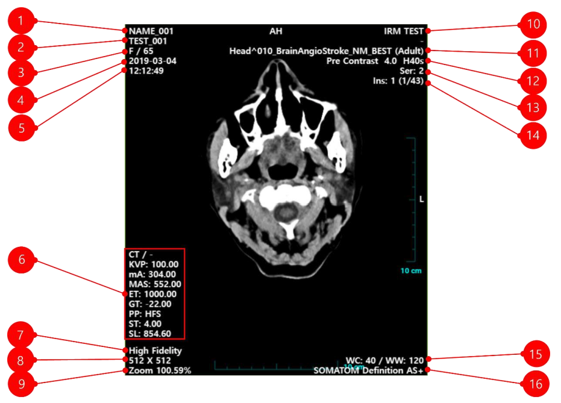
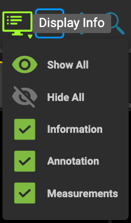
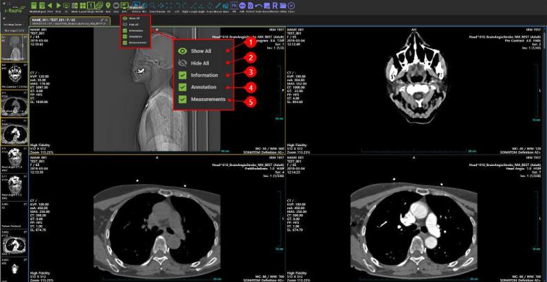

# Display Info

## 의료영상정보 표시 내용

영상표시창의 영상 위에 환자정보, 영상정보, 주석정보, 측정정보를 표시하거나 숨길 수 있습니다.

1. Patient Name 환자이름
2. Patient ID 환자번호
3. Age / Sex 환자나이 / 성별
4. Content Date 영상 날짜(촬영일자)
5. Cotent Time 영상 시간(촬영시간)
6. Modality 장비별 관련 정보
7. Image Quality 이미지 퀄리티
8. Width*Height 영상 사이즈(가로*세로 픽셀수)
9. Zoom 이미지 줌 비율
10. Institution 병원이름
11. Series Description 시리즈 설명
12. Series Number 시리즈 번호
13. Instance Number 이미지 번호(현재 조회중인 인덱스/전체 인덱스)
14. VOI LUT Type 영상 타입
15. Window Width/Level 윈도우 레벨
16. Modality Manufacturer 장비 제조사

메뉴바의 [Info] 메뉴의 [Information] 하위 메뉴를 선택하면 영상표시창의 영상 위에 환자정보,
스터디 정보, 영상정보 등이 표시됩니다.

1. 메뉴바에서 [Info] 메뉴를 클릭합니다.

2. [Info] 메뉴의 하위메뉴에서 영상 위에 표시하거나 숨기기를 원하는 항목을 선택합니다.

1. Show All 선택 시 Information, Annotation, Measurements 정보를 모두 표시합니다.
2. Hide All 선택 시 Information, Annotion, Measuremens 정보를 모두 표시하지 않습니다.
3. Information 선택 시 의료영상정보를 영상 위에 표시합니다. 선택 해제 시 의료영상정보를 영상위에 표시하지 않습니다.
4. Annotation 선택 시 주석(Annotation) 정보를 영상 위에 표시합니다. 선택 해제 시 주석(Annotation) 정보를 영상위에 표시하지 않습니다.
5. Measurements 선택 시 측정(Annotation) 정보를 영상 위에 표시합니다. 선택 해제 시 측정(Annotation) 정보를 영상위에 표시하지 않습니다.
6. Overlay 선택 시 레이어 이미지(Overlay)가 있는 영상의 경우 레이어를 겹쳐서 표시합니다. 선택 해제 시 레이어 이미지(Overlay)가 있는 영상의 경우 레이어를 표시 하지 않습니다.

