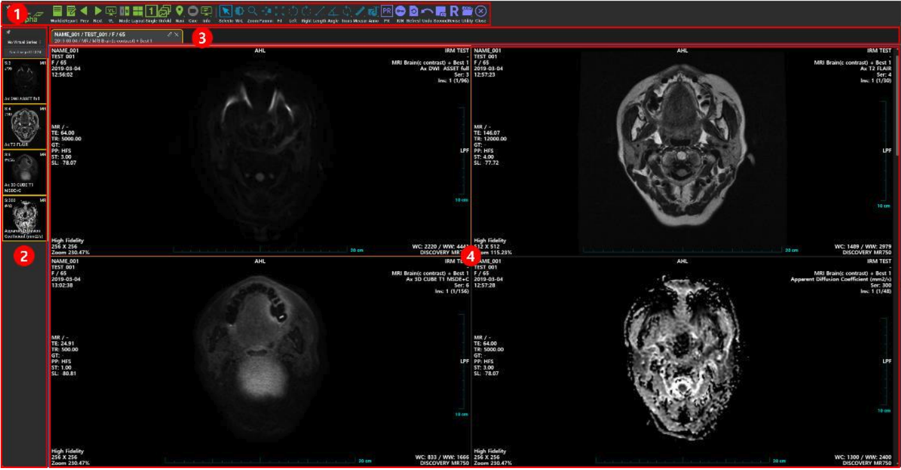

# I-Rapha View™

I-Rapha View™ is a DICOM viewer software that allows users to view DICOM images transmitted from medical imaging devices using web standards (HTML5).
This manual is designed to help users better understand and utilize the features of I-Rapha View™.
It can be used in web browsers that support HTML5 without the need for any additional plugin installation. This application provides various medical image manipulation functions necessary for diagnostics and interpretation. I-Rapha View™ is a certified medical device approved by the Ministry of Food and Drug Safety.
* Approval Number: 제인 18-4032 호
* Product Name: Medical Imaging Transmission Device Software
* Classification Number: A26430.03
* Grade: Class II
* Manufacturer: IRM Inc., Medical Imaging Transmission Device Software, I-Rapha View

------

## Navigation 

I-Rapha View™ displays DICOM images and provides various medical image manipulation functions required for diagnosis and interpretation. The I-Rapha View™ interface consists of a menu bar, toggle buttons, series thumbnail window, and image display window.

--------

## FAQ

Visit the I-one DICOM Viewer [Tutorial](./5_Tutorials/index.md) or  [FAQ](../FAQ/intro.md) to find answers to frequently asked questions or issues.
----

Copying, printing, or distributing this document without the explicit written consent of IRM Inc. is prohibited. The content of this document is subject to change without prior notice. While this document has been carefully prepared, there may be errors or omissions. If you have any questions or find any errors, please contact us.

Copyright© 2024 by IRM Inc.